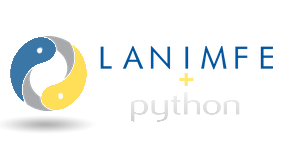
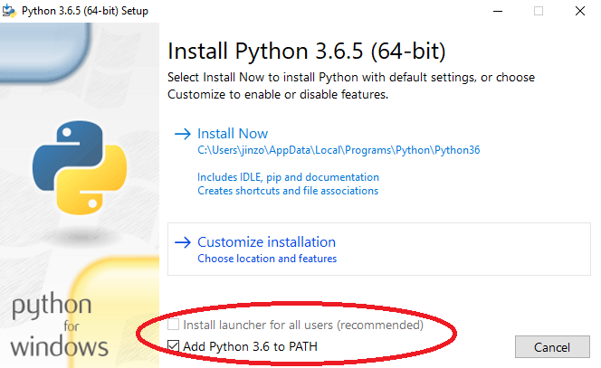
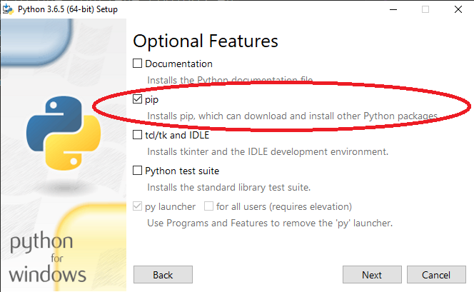

<script src="https://polyfill.io/v3/polyfill.min.js?features=es6"></script>
<script id="MathJax-script" async src="https://cdn.jsdelivr.net/npm/mathjax@3/es5/tex-mml-chtml.js"></script>

# pynimfe


Repositorio que contiene códigos en Python para resolver las ecuaciones de la teoría autoconsistente de Langevin de no equilibrio. Éste repositorio funciona con las paqueterías de ```numpy``` y ```scipy```. Para instalarlos correctamente, al instalar python en tu computadora asegurate de añadir al PATH la variable de entorno de python.



Asegúrate de que se instale el gestor de paquetes ```pip``` (acr
onimo recursivo de "Pip Installs Packages")



Una vez instalado, desde tu línea de comandos actualiza ```pip``` escribiendo
```
python -m pip install -–upgrade pip
```
ya actualizado, instala numpy
```
pip install numpy
```
e instala scipy
```
pip install scipy
```
para asegurarte de que se instalaron correctamente escribe en la linea de comandos
```
pip freeze
```
y debe aparecer una lista que incluya
```
numpy==1.19.5
scipy==1.5.4
```
Listo. Ya tienes lo que se necesita para iniciar con éstos códigos.
